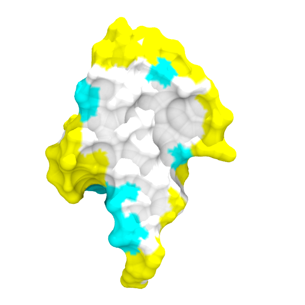

# sasa-color
Color buried area properly in VMD.

Using ubiquitin (PDB: 1UBQ) as an example:

1. Generate the .cor and .psf files of 1ubq.pdb (e.g. using CHARMM-GUI).
2. `$CHARMM < compute-sasa.inp > log-sasa.out`
3. `python alter-beta.py 1ubq-charmm.pdb log-sasa.out`
4. `vmd 1ubq-sasa.pdb -e set-colors.tcl` to load the system. Then use **Surface**/**MSMS** representation and color by **beta**.

In the following demo, the burried residues will be colored white no matter how we slice the protein, while the exposed hydrophobic residues are colored cyan and the others will be colored yellow.

